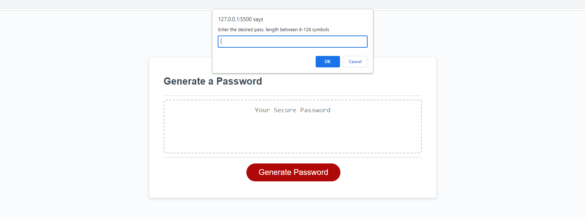

# Password Generator

A simple password generator web application that allows users to generate secure passwords with various character types.

![Password Generator]

## Table of Contents

- [Description](#description)
- [Screenshots](#screenshots)
- [Usage](#usage)
- [License](#license)

## Description

This web application provides a user-friendly interface to generate strong and secure passwords based on user preferences. Users can choose the length of the password and specify whether to include uppercase letters, lowercase letters, numbers, and special symbols.

## Screenshots

.png)   

.png)

## live Page
https://jorjik81.github.io/hilarious-earth3/

## Usage

1. Open the [Password Generator](https://example.com/password-generator) in your web browser.
2. Click the "Generate Password" button.
3. Follow the prompts to select the desired password length and character types.
4. Your generated password will be displayed in the text area.

## License

This project is licensed under the [MIT License](LICENSE).

© 2023 Your Name